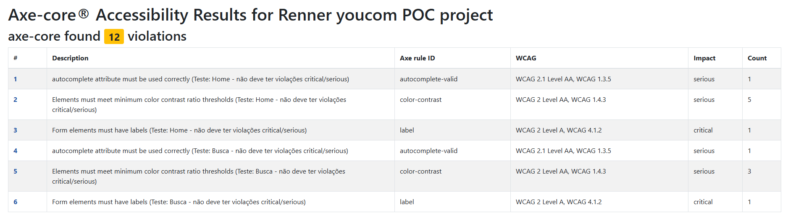

# ♿ POC – Automação de Testes de Acessibilidade

## 📌 Objetivo

Esta Prova de Conceito (POC) tem como objetivo demonstrar a viabilidade da automação de testes de acessibilidade utilizando **Cypress + axe-core**, seguindo as diretrizes da **WCAG 2.1 nível AA**.

A proposta é identificar automaticamente violações críticas e sérias de acessibilidade e gerar evidências em formato de relatório.

---

## 🛠 Tecnologias Utilizadas

- Node.js
- Cypress 15.x
- cypress-axe- axe-core (Deque Systems)
- axe-html-reporter (geração de relatório HTML)

---

## 🌐 Sistema Avaliado

- https://www.youcom.com.br/

---

## 🔎 Escopo da POC

Foram analisados os seguintes cenários:

1. Home (não autenticado)
2. Buscar um produto

As verificações foram executadas considerando severidades:

- `critical`
- `serious`

---

## 🚀 Como Executar

```bash
git clone https://github.com/loopfagundes/automacao-e2e-poc
```

```bash
cd automacao-e2e-poc
```

### 1️⃣ Instalar dependências

```bash
npm install
```
### Como utilizar:

### 2️⃣ Executar os testes

```bash
npx cypress run
```

Rodar testes (headless)

```bash
npm run cy:run
```

Rodar em Chrome (recomendado)

```bash
npm run cy:run:chrome
```

Abrir UI do Cypress

```bash
npm run cy:open
```

### 3️⃣ Gerar relatório HTML

O relatório será gerado automaticamente em:

```bash
/reports/*report.html
```

### 4️⃣ Opcional: converter para PDF:

Instalar puppeteer

```bash
npm i -D puppeteer
```

PDF gerar

```bash
npm run report:pdf
```

### Como utilizar:

Via script (Recomendado): O arquivo package.json, utilize o comando simplificado:
```bash
npm run <scripts>
```

### Evidencia:



- Relatório PDF

[Clique aqui para ver o relatório em PDF](reports/renner-youcom-report.pdf)

---
